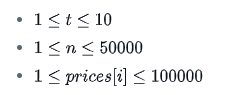

# Stock-Maximize

Your algorithms have become so good at predicting the market that you now know what the share price of Wooden Orange Toothpicks Inc. (WOT) will be for the next number of days.

Each day, you can either buy one share of WOT, sell any number of shares of WOT that you own, or not make any transaction at all. What is the maximum profit you can obtain with an optimum trading strategy?

## Example
```
prices = [1, 2]
```
Buy one share day one, and sell it day two for a profit of **1**. Return **1**.
```
prices = [2, 1]
```
No profit can be made so you do not buy or sell stock those days. Return **0**.

## Function Description
Complete the stockmax function in the editor below.

stockmax has the following parameter(s):

- prices: an array of integers that represent predicted daily stock prices

## Returns
int: the maximum profit achievable

## Contraints


## Sample Input
```
prices = [5, 3, 2]
prices = [1, 2, 100]
prices =[1, 3, 1, 2]
```

## Sample Output
```
0
197
3
```
## Explanation

- For the first case, there is no profit because the share price never rises, return **0**.
- For the second case, buy one share on the first two days and sell both of them on the third day for a profit of **197**.
- For the third case, buy one share on day 1, sell one on day 2, buy one share on day 3, and sell one share on day 4. The overall profit is **3**.


